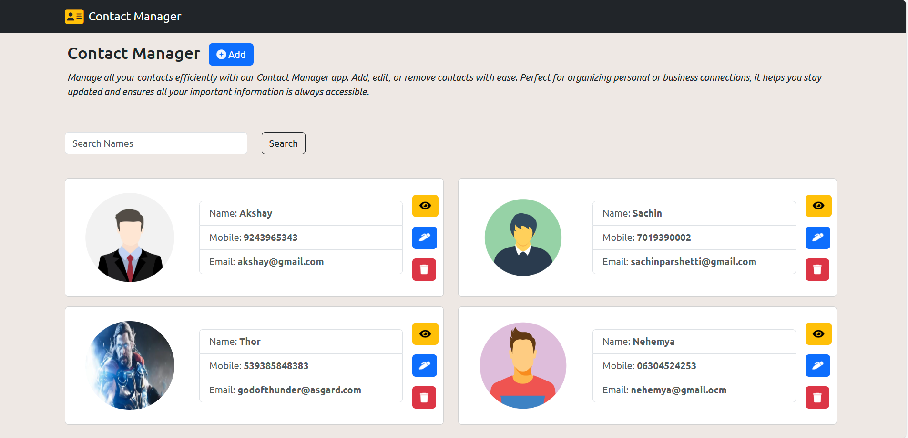
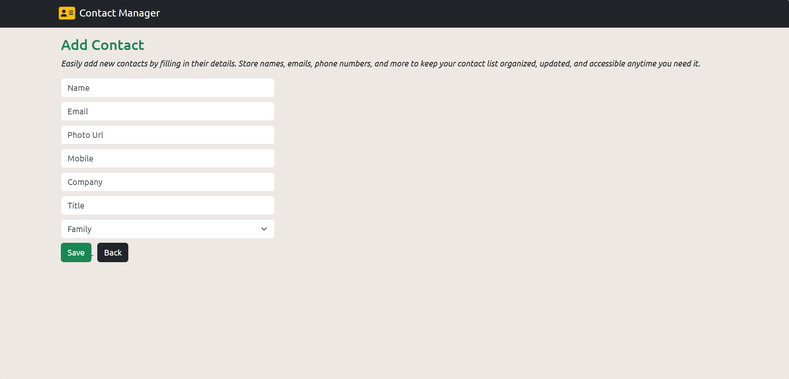
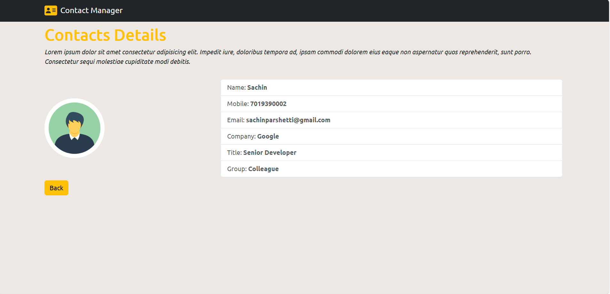
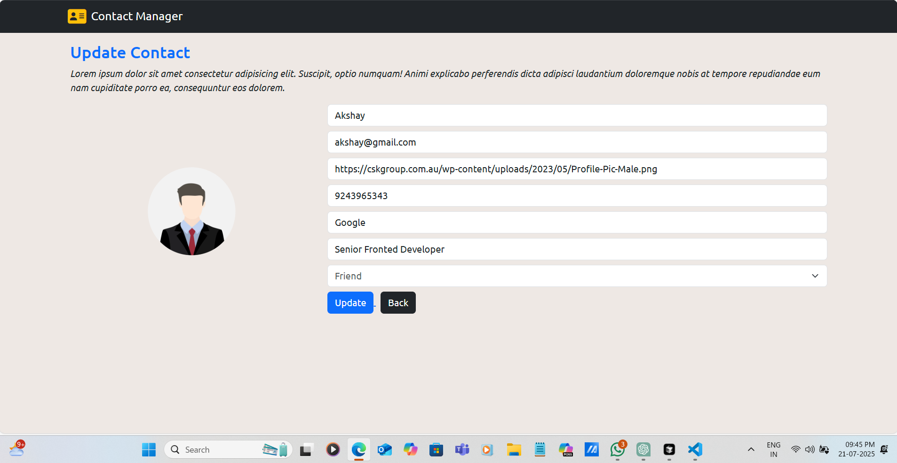

# 📇 Contact Manager App

A full-stack Contact Management application built using the **MERN stack**, allowing users to **Add**, **View**, **Edit**, **Delete**, and **Search** contacts. It offers a sleek, responsive interface with intuitive features and elegant alerts for better user interaction.

**Deployed on:**
- 🌐 **Frontend**: Netlify  
- 🔗 **Backend**: Render  
- ☁️ **Database**: MongoDB Atlas

---

## 🌐 Live Demo

- 🔸 Frontend: [https://your-contact-manager.netlify.app](https://contactmanagerapps.netlify.app/)  
- 🔸 API Base: [https://contact-manager-api.onrender.com](https://contact-app-wwd5.onrender.com)

---

## 📸 Screenshots

  
  
  


---

## ⚙️ Tech Stack

### 🔹 Frontend (React)
- React
- React Router DOM
- Axios
- Bootstrap 5
- Font Awesome
- Toastify
- SweetAlert2

### 🔹 Backend (Node.js + Express)
- Node.js
- Express.js
- MongoDB Atlas + Mongoose
- CORS
- dotenv

---

## 🧠 Features

✅ Add New Contacts  
✅ View Detailed Contact Info  
✅ Edit Existing Contacts  
✅ Delete Contacts with Confirmation  
✅ Search Contacts by Name  
✅ Alerts & Notifications with SweetAlert2 + Toastify  
✅ Loading Spinners  
✅ Fully Responsive UI  

---

## 🗂 Project Structure

contact-manager/
├── client/
│ ├── components/
│ │ ├── ContactList.jsx
│ │ ├── ViewContact.jsx
│ │ └── Spinner.jsx
│ ├── services/
│ │ └── contactService.js
│ ├── App.jsx
│ └── main.jsx
│
├── backend/
│ ├── models/
│ │ └── Contact.js
│ ├── routes/
│ │ └── contactRoutes.js
│ ├── controllers/
│ │ └── contactController.js
│ ├── server.js
│ └── config/db.js

yaml
Copy
Edit

---

## 🚀 Deployment Guide

### 🔸 Backend (Render)
1. Push your `backend/` folder to GitHub.
2. Create a Web Service on Render.
3. Set Root Directory: `backend`
4. Build Command: `npm install`
5. Start Command: `node server.js`
6. Add Environment Variables in Render:
   - `MONGO_URI` = your MongoDB Atlas connection string

### 🔸 Frontend (Netlify)
1. Push your `client/` folder to GitHub.
2. Create a new site on Netlify.
3. Build Command: `npm run build`
4. Publish Directory: `dist`
5. Add Environment Variable:
   - `VITE_API_URL=https://contact-manager-api.onrender.com`

---

## 💡 Local Development

### ▶️ Run Backend:
```bash
cd backend
npm install
npm run dev
▶️ Run Frontend:
bash
Copy
Edit
cd client
npm install
npm run dev
📚 API Endpoints (Sample)
Method	Endpoint	Description
GET	/contacts	Get all contacts
GET	/contacts/:id	Get a single contact
POST	/contacts	Add a new contact
PUT	/contacts/:id	Update a contact
DELETE	/contacts/:id	Delete a contact

📦 Coming Soon
🌓 Dark Mode Support
🔎 Advanced Filtering (Email/Mobile)
📥 Import & Export Contacts
📱 Progressive Web App (PWA)


## 🙋‍♂️ Author  
**Sachin Parashetti**  
🧑‍💻 Passionate Full-Stack Developer | MERN | REST APIs | UI/UX

- 📎 [GitHub – @SachinParashetti](https://github.com/SachinParashetti)
- 📎 [LinkedIn – sachin-parashetti](https://www.linkedin.com/in/sachin-parashetti-99b255259/)
- 📧 Email: [sachinparshettisp@gmail.com](mailto:sachinparshettisp@gmail.com)
